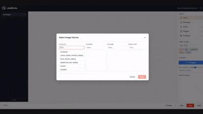

# LabelBricks

Lightweight image annotation web app built on **Databricks Apps**, with **Unity Catalog Volumes** for both image storage and annotation persistence (JSON sidecars — no database), and **Foundation Model APIs** for AI-assisted labeling.



## Features

- **5 annotation tools** — Select, Rectangle, Circle, Polygon, Freehand (keyboard shortcuts 1-5)
- **AI-assisted labeling** — On-demand vision model suggestions (Claude Sonnet via FMAPI) with accept/edit/reject workflow and confidence threshold filtering
- **Catalog/schema/volume browser** — Cascading picker to select any UC Volume directory as your image source
- **Persistent storage** — one annotation JSON sidecar per image on the Volume; review status survives sessions. Nothing to provision.
- **Label management** — Free-text label input with recent label chips (kept in browser localStorage)
- **Draw-then-label UX** — Floating label popup appears after drawing, with recent label chips for fast annotation
- **Undo/Redo** — Snapshot-based history (Ctrl+Z / Ctrl+Y)
- **Image queue** — Sidebar with lazy-loaded thumbnails, status badges, and progress tracking
- **OAuth authentication** — No PATs or `.env` files required. CLI profile locally, service principal OAuth when deployed

## Tech Stack

| Layer | Technology |
|-------|------------|
| Backend | Python / Flask (Gunicorn) |
| Frontend | Vanilla JS + Fabric.js v4.6.0 (16 ES6 modules, no build step) |
| Platform | Databricks Apps |
| Image Storage | Unity Catalog Volumes |
| Annotation Storage | JSON sidecars on the same UC Volume (`.labelbricks/annotations/`) |
| AI | Databricks Foundation Model APIs via a thin `requests` client (`libraries/ai_client.py`) |
| Auth | Databricks OAuth 2.0 / SSO |
| Deployment | Databricks Asset Bundles (`databricks.yml`) |
| Dev Tooling | `uv` for dependency management |

## Setup

### Prerequisites

1. Databricks workspace with Unity Catalog enabled
2. Ability to create Databricks Apps
3. A UC Volume with images to annotate
4. [Databricks CLI](https://docs.databricks.com/en/dev-tools/cli/install.html) installed and authenticated
5. [uv](https://docs.astral.sh/uv/) installed (or `pip`)

### Step 1: Clone and Install

```bash
# from the repo root
cd labelbricks
uv sync
```

### Step 2: Authenticate with Databricks CLI

```bash
databricks auth login --host https://<your-workspace-host>
```

This opens a browser for SSO, then prompts you for a **profile name** (press Enter to accept the
suggested one). That profile is what local development uses — no `.env` file or PAT is needed. If it
isn't your DEFAULT profile, run the app with
`DATABRICKS_CONFIG_PROFILE=<your-profile> uv run python app.py`.

### Step 3: Prepare a UC Volume

1. In your Databricks workspace, create a Volume under the catalog and schema of your choice
2. Upload some images to the Volume

### Step 4: Run Locally

```bash
uv run python app.py
```

Open `http://localhost:5000`, select your Volume from the browser, and start annotating.

> **Tip:** If your DEFAULT CLI profile isn't pointed at the right workspace, set `DATABRICKS_CONFIG_PROFILE=<profile-name>` before running.

### Step 5: Deploy to Databricks Apps

The app deploys as part of the repo-root bundle — see the top-level `README.md` for the full
walkthrough. In short, from the **repo root**:

```bash
databricks bundle deploy --var="catalog=my_catalog,existing_cluster_id=...,warehouse_id=..."

# Start / restart the app so it picks up the deployed code
databricks bundle run labelbricks
```

The app's service principal needs `WRITE_VOLUME` permission on your Volume, which is handled automatically by the `uc_securable` declaration in `databricks.yml`.

### Where annotations are stored

There is nothing else to set up. Saving writes one JSON sidecar per image next to the images:

```
<volume>/.labelbricks/annotations/<image>.json    # shapes, labels, status, notes, image dims
<volume>/.labelbricks/composites/<image>.png      # flattened preview
```

Review status lives in those files, so the sidebar badges survive a reload. Recently-used labels are
kept per-browser in `localStorage` — annotators do not share an autocomplete vocabulary.

## Project Structure

```
labelbricks/                      # (the DAB manifest lives at the repo root)
├── app.py                        # Flask application
├── app.yaml                      # Databricks App runtime config
├── pyproject.toml                # uv project config
├── requirements.in               # Direct deps (edit this)
├── requirements.txt              # Pinned lockfile (what the app installs)
├── libraries/
│   └── ai_client.py              # FMAPI vision client (image -> bbox suggestions)
├── templates/
│   ├── index.html                # Main annotation UI (Fabric.js canvas)
│   └── set_volume.html           # Landing page
├── static/
│   ├── style.css                 # Databricks-aligned design system
│   └── js/                       # 16 ES6 modules
│       ├── app.js                # Entry point (LabelBricksApp orchestrator)
│       ├── api-client.js         # Backend API wrapper
│       ├── canvas-manager.js     # Fabric.js canvas lifecycle
│       ├── tool-manager.js       # Tool state machine + shortcuts
│       ├── annotation-store.js   # In-memory annotation model
│       ├── label-manager.js      # Label input + recent-label chips
│       ├── label-popup.js        # Post-draw labeling popup
│       ├── sidebar.js            # Image queue + thumbnails
│       ├── volume-browser.js     # Catalog/schema/volume modal
│       ├── undo-manager.js       # Undo/redo (Ctrl+Z/Y)
│       ├── ai-suggest.js         # AI suggestion lifecycle
│       └── tools/                # Select, Rectangle, Circle, Polygon, Freehand
```

## How It Works

1. **Select a Volume** — The catalog/schema/volume browser lets you pick any UC Volume directory containing images
2. **Browse images** — The sidebar shows thumbnails with status badges (pending/reviewed/done)
3. **Annotate** — Use rectangle, circle, polygon, or freehand tools to draw bounding boxes and regions. A label popup appears after each annotation for labeling
4. **AI Suggest** — Click the AI Suggest button to get vision model predictions rendered as dashed blue overlays. Accept, edit, or reject each suggestion
5. **Save** — Annotations are written as a JSON sidecar on the Volume, plus a composite overlay PNG

## Resources

- [Databricks Apps Documentation](https://docs.databricks.com/en/dev-tools/databricks-apps/index.html)
- [Databricks Apps Cookbook](https://apps-cookbook.dev/docs/intro)
- [Unity Catalog Volumes](https://docs.databricks.com/en/connect/unity-catalog/volumes.html)
- [Foundation Model APIs](https://docs.databricks.com/en/machine-learning/model-serving/score-foundation-models.html)
